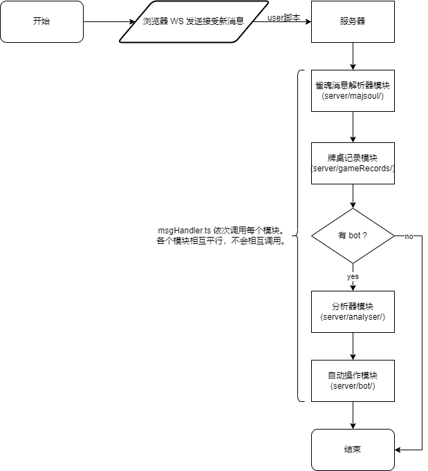

# majsoul-analyser 文档

## 什么是 majsoul-analyser ？

帮助你
  - 自动打立直麻将。
  - 自动开下一局。

支持
  - 雀魂 [game.maj-soul.com](https://game.maj-soul.com/1/)
  - 未来会支持天凤等其他平台

## 项目结构总述

本程序由 Typescript 编写，用 vite 构建用户浏览器脚本，用 ts-node 运行服务端（不用手动`tsc`转译成 js）。

- 用户脚本：源码 `user/` 下, `npx vite build` 构建到 `dist/` 下。负责将雀魂的牌桌 WS 消息转发给服务端。目前仅转发对局消息，不转发Lobby类的消息。

- 服务器：源码 `src/` 下, 用 `ts-node server/index.ts` 运行服务端。

  将收到的二进制消息转发给消息处理器（server/msgHandler.ts）。消息处理器依次调用雀魂消息解析器模块 (server/majsoul)、牌桌记录模块 (server/gameRecords)、分析器模块 (server/analyser)、自动操作模块 (server/bot)贯通处理
  
  - **雀魂消息解析器模块 (server/majsoul/)**：解析雀魂的二进制消息，解析规则可能有更新而导致这一块解析出错，届时请及时提醒开发者更新。
  
  - **牌桌记录模块 (server/gameRecords/)**：记录对局状态。因为雀魂的消息是流程化的，也就是每一条消息只会告诉前端这一步的动作，而非牌桌信息，所以需要记录流程。
  
  - **分析器模块 (server/analyser/)**：暂时使用 [mahjong-helper
  ](https://github.com/EndlessCheng/mahjong-helper) 包装了一个初级分析器，返回一些操作结果 (operations)
  
  - **自动操作模块 (server/bot/)**：使用 opencv.js 识别桌面，并通过 robot.js 操作鼠标点击

  

