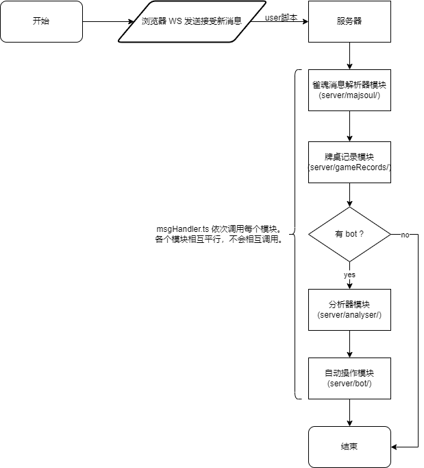

# majsoul-analyser 文档

## 什么是 majsoul-analyser ？

雀魂对局分析助手：解析牌局 WebSocket 消息，记录牌桌状态，并调用分析器给出操作建议。

支持
  - 雀魂 [game.maj-soul.com](https://game.maj-soul.com/1/)
  - 天凤（开发中）

## 项目结构总述

本程序由 Typescript 编写，用 vite 构建用户浏览器脚本，用 bun 运行服务端。

- 用户脚本：源码 `user/` 下，构建到 `dist/` 下。负责将雀魂的牌桌 WS 消息转发给服务端。

- 服务器：源码 `server/` 下，用 `bun run server/index.ts` 启动。

  将收到的二进制消息转发给消息处理器（`server/msgHandler.ts`），依次调用：

  - **雀魂消息解析器模块 (`server/majsoul/`)**：解析雀魂二进制消息，输出标准 [MJAI](https://mjai.app/docs/mjai-protocol) 事件。

  - **牌桌记录模块 (`server/gameRecords/`)**：根据 MJAI 事件流维护牌桌状态。

  - **分析器模块 (`server/analyser/`)**：将备选操作细化为 MJAI action，并调用具体分析器（默认 `analyser-mahjong_helper`）。

  
