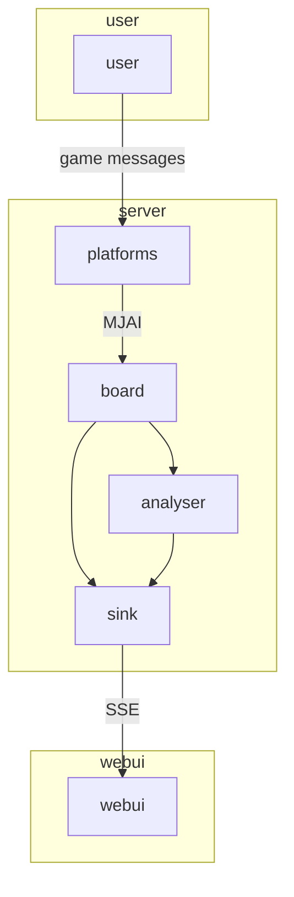

# Overview

 

  
  
  

## Pipeline

平台消息先变成 [MJAI](https://mjai.app/docs/mjai-protocol)，供 board / analyser 使用。

| Module | Path | 职责 |
| --- | --- | --- |
| [user](./user) | `user/` | 转发平台对局消息 |
| [platforms](./platforms) | `server/platforms/` | 平台消息 → MJAI |
| [board](./board) | `server/board/` | 维护 `Game` / `Round` |
| [analyser](./analyser) | `server/analyser/` | 分析、统计 |
| [server sink](./server-sink) | `server/UI/` | 推送快照给浏览器 |
| [webui](./webui) | `web/` | 网页画牌桌 |

流水线在 `server/pipeline/Pipeline.ts`：platforms → board → analyser → UI。

局面以 **board** 为准；**UI** 负责推送；怎么画交给 **webui**。
