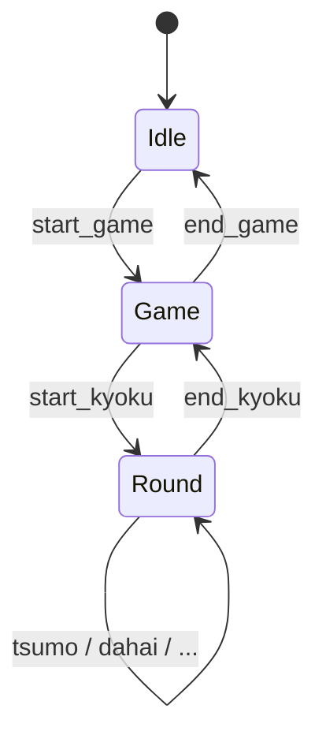

# board

源码：`server/board/`

消费 MJAI 消息，增量地维护对局状态。内部使用 `Game` 和 `Round` 数据结构。

| 类型 | 说明 |
| --- | --- |
| `class Game` | 一整场 |
| `class Round` | 一局（手牌、河、副露、点数、摸牌、立直横置等） |
| `applyEvent()` | 把一条 MJAI 应用到当前局 |

状态转移示意如下：

