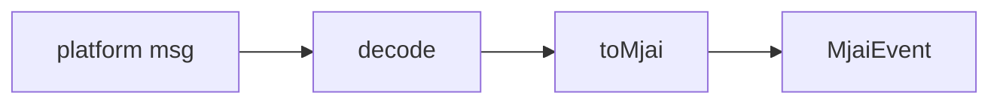

# platforms

源码：`server/platforms/`

平台适配器，将各平台原始消息转成 MJAI，供后面的模块使用。

| 实现 | 状态 | 说明 |
| --- | --- | --- |
| `platforms/majsoul` | 可用 | protobuf 解包 + `toMjai` |
| `platforms/tenhou` | 开发中 | 同样输出 MJAI |
| `platforms/mjai` | 可用 | 入站已是 MJAI JSON，几乎透传 |

均在 `platforms/registry.ts` 内注册。

### mjai 入站格式

`POST /?msg=res&game=mjai`，body 为 UTF-8 JSON：

- 单条 event，或 event 数组
- 或信封：`{ "events": [...], "candidates"?: [...], "possible_actions"?: [...] }`

需要分析时带上 `candidates`（粗粒度）或 `possible_actions`（完整 MJAI action，会折成 candidates）。`start_game.id` 为己方座位。
